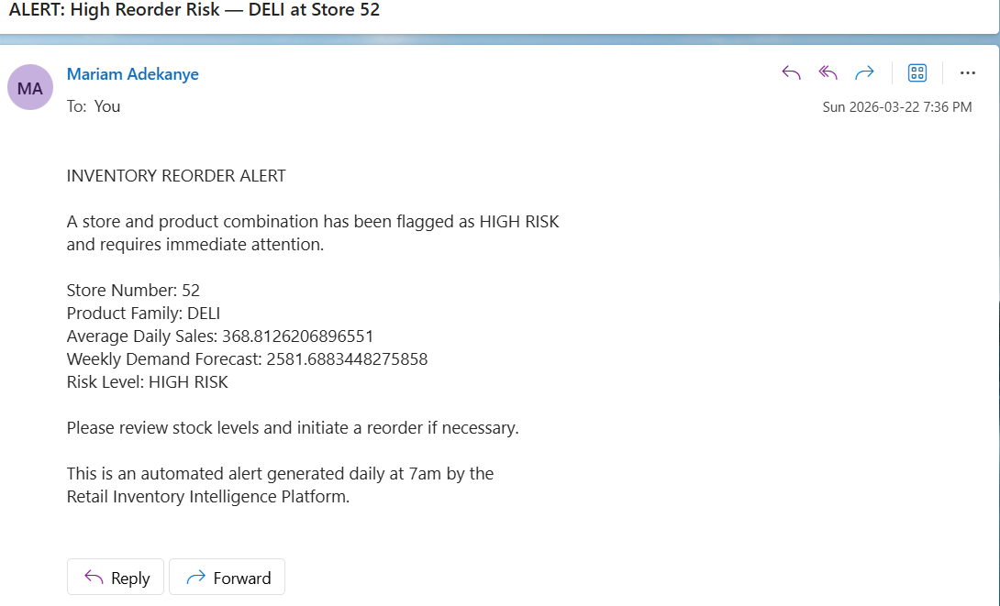

# Retail Inventory Intelligence Platform

An end-to-end retail analytics platform built with Microsoft Fabric, 
Power BI, SQL, Python, and Power Automate. The project tackles a 
real-world supply chain problem — inventory blindspots that cause 
stockouts and overstock — by building a full data pipeline from raw 
ingestion through to automated alerting.

---

## The Problem

Retail businesses lose billions annually to inventory distortion. 
Most mid-size retailers manage stock levels reactively using Excel 
with no forward visibility. This platform surfaces demand risk 
automatically every morning so supply chain teams can act before 
a stockout happens — not after.


## Architecture
```
Kaggle Retail Dataset (3M+ rows)
        │
        ▼  Fabric Data Factory
OneLake Files/ (Raw CSVs)
        │
        ▼  PySpark Notebook
Bronze Delta Tables
(bronze_sales, bronze_stores, bronze_oil, bronze_holidays)
        │
        ▼  PySpark Notebook — Cleaning & Typing
Silver Delta Tables
(silver_sales, silver_stores, silver_oil, silver_holidays)
        │
        ▼  SQL Analytics Endpoint — Views
Gold Layer
(gold_daily_sales, gold_inventory_risk, gold_promotion_impact,
 gold_forecast)
        │                              │
        ▼  Direct Lake                 ▼  Power Automate
Power BI Semantic Model          Daily Email Alerts
        │
        ▼
Executive Report + Operations Report
```

---

## Tech Stack

| Tool | Purpose |
|------|---------|
| Microsoft Fabric | Cloud lakehouse, data pipelines, notebooks |
| OneLake | Delta table storage (Bronze, Silver, Gold layers) |
| PySpark | Data ingestion and Silver layer transformations |
| SQL Analytics Endpoint | Gold layer views and data quality checks |
| Prophet (Python) | Demand forecasting model |
| Power BI Desktop | Semantic model, DAX measures, report building |
| Power BI Service | Report publishing and sharing |
| Power Automate | Automated daily reorder alert emails |
| GitHub | Version control and portfolio documentation |

---

## Key Features

### 1. Medallion Architecture (Bronze → Silver → Gold)
Raw Kaggle CSV files land in the Bronze layer as Delta tables 
via PySpark notebooks. The Silver layer applies data cleaning — 
fixing date types, clipping negative sales to zero, forward-filling 
oil prices across weekends, and handling transferred holidays 
correctly. The Gold layer exposes analytics-ready SQL views that 
Power BI reads directly.

**Why this matters:** Each layer serves a different consumer. 
Bronze is for reprocessing. Silver is for data science. Gold is 
for BI tools. If upstream logic changes, only the affected layer 
needs to be rebuilt — nothing downstream breaks automatically.

---

### 2. SQL Analytics Endpoint — Gold Layer Views
Three Gold views built directly on Silver Delta tables using 
T-SQL through the Fabric SQL Analytics Endpoint:

- `gold_daily_sales` — joins sales, stores, holidays and oil 
  prices into one analytics-ready fact view
- `gold_inventory_risk` — calculates weekly demand forecast and 
  classifies each store/product as HIGH, MEDIUM or LOW RISK
- `gold_promotion_impact` — compares average sales on promotion 
  vs off promotion days by product family

All SQL scripts are saved in the `/sql` folder with documented 
design decisions.

---

### 3. Power BI Semantic Model With 10 DAX Measures
Connected to the Gold layer via Direct Lake mode — no data 
copying, no scheduled refresh lag. Built a star schema with a 
Date dimension table and 10 DAX measures covering:

- Time intelligence (Sales LY, YoY Growth %, Rolling 7D Sales)
- Promotion analysis (Sales on Promo, Promo Uplift %)
- Inventory risk (High Risk Stores, Weeks of Supply)
- Holiday impact (Holiday Sales)

All measures documented in `/dax/measures.md`.

---

### 4. Demand Forecasting With Prophet
Python-based forecasting model running inside a Fabric Notebook. 
Trained on 4 years of daily sales history per store and product 
family. Generates 28-day forward forecasts with confidence 
intervals (yhat, yhat_lower, yhat_upper). Forecast results 
written back to a Gold Delta table and connected to Power BI 
for overlay on the actual sales trend line.

Scaled across 15 store and product family combinations 
(3 stores × 5 product families) using a loop with per-group 
model fitting.

---

### 5. Two Power BI Reports for Different Audiences
Built two separate reports from the same semantic model — 
demonstrating that the same data can serve different stakeholders 
with different information needs:

**Executive Report** — single page, 5 visuals maximum, KPI cards, 
trend with forecast overlay, risk map. Designed for a VP or CFO 
who needs the headline picture in under 30 seconds.

**Operations Report** — 4 pages with drillthrough navigation, 
conditional formatting on risk levels, forecast vs actual chart 
with confidence band, and a reorder alerts table with sparklines.


### 6. Automated Reorder Alert System
Built a scheduled Power Automate flow that queries the 
`gold_inventory_risk` view every morning at 7am and sends 
email alerts for any HIGH RISK store and product combinations. 
Alert emails include store number, product family, average 
daily sales, and weekly demand forecast pulled directly from 
the database.

**Tools:** Power Automate, Outlook connector, SQL Analytics Endpoint  
**Screenshot:** see `/screenshots/automate_email_alert.png`



