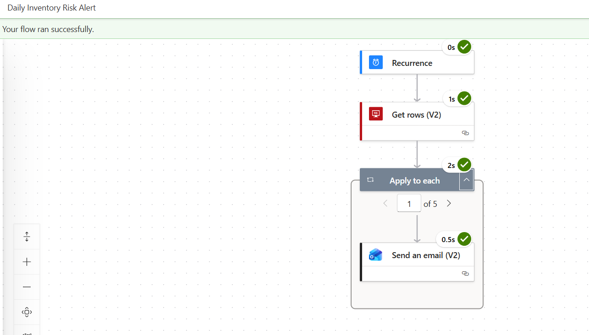

# Daily Inventory Risk Alert — Power Automate Flow

## Purpose
Automatically emails a store manager each morning when a 
store and product family combination is classified as HIGH RISK 
in the gold_inventory_risk view. Eliminates the need for manual 
daily checks of the Power BI dashboard.

## Trigger
Scheduled — runs every day at 7am automatically.

## Flow Structure
```
Recurrence (daily 7am)
        │
        ▼
Get Rows — gold_inventory_risk
Filter: reorder_risk_level eq 'HIGH RISK'
Top Count: 5
        │
        ▼
Apply to Each (one iteration per HIGH RISK row)
        │
        ▼
Send Email (Gmail)
Subject: ALERT: High Reorder Risk — [product_family] at Store [store_nbr]
Body: store number, product family, avg daily sales, 
      weekly demand forecast, risk level
      
```

## Design Decisions

**Why filter at the Get Rows level instead of using a Condition step?**
Filtering at the source means only HIGH RISK rows travel through 
the flow. This is more efficient than retrieving all rows and 
filtering inside the loop, and avoids Power Automate's 8-level 
nesting limit.

**Why Top Count = 5?**
Limits emails per run to avoid email sending thresholds being 
triggered. Sufficient for portfolio demonstration purposes. In 
production this would be removed and replaced with proper 
recipient routing per store manager.


## What This Demonstrates
- End-to-end workflow automation beyond static dashboards
- Data-driven alerting connected directly to the Gold layer
- Understanding of Power Automate connector architecture
- Production thinking — the risk classification logic lives in 
  SQL (gold_inventory_risk view) not in the flow, meaning 
  threshold changes require only a SQL update, not a flow edit

## Screenshot
See /screenshots/automate_email_alert.png

